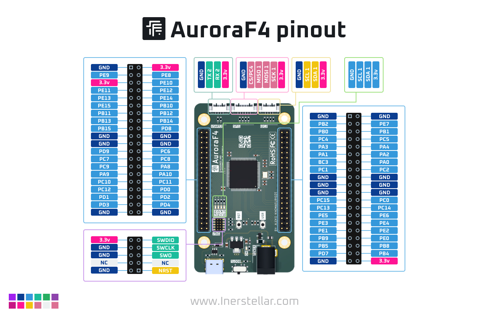
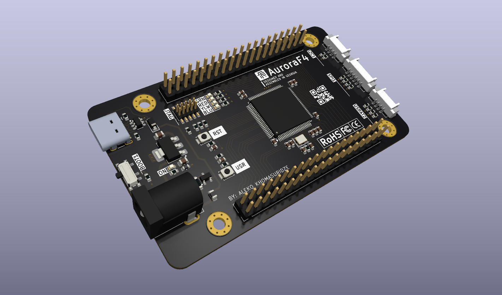

# AuroraF4

AuroraF4 is a powerful development board based on the STM32F407VGT microcontroller, designed to provide developers with a feature-rich and compact solution for embedded system projects. This board is equipped with multiple peripherals, GPIOs, and expansion headers, making it ideal for both beginners and professionals.

## Features

- **Microcontroller**: STM32F407VGT
  - ARM Cortex-M4 processor
  - 168 MHz clock speed
  - 1 MB Flash, 192 KB SRAM
- **Interfaces**:
  - SPI, I2C, USART
  - JTAG/SWD debugging support
- **Peripherals**:
  - User-configurable LEDs (Green, Red, Yellow, Blue)
  - Reset (RST) and User (USR) buttons
  - Power input via USB-C or barrel jack
- **Expansion**:
  - Pin headers for GPIO access
  - 3.3V and GND pins available for peripherals
- **Power**:
  - Powered via USB-C or external 12V input

## Pinout Diagram

Refer to the pinout diagram above for GPIO assignments and interface connections.

## PCB Design and Layout

### PCB Top View

### 3D Render

## Getting Started

### Prerequisites

- Install [STM32CubeIDE](https://www.st.com/en/development-tools/stm32cubeide.html) for firmware development.
- Set up the STM32CubeMX tool for peripheral configuration.

### Powering the Board

1. Connect a USB-C cable to the power port.
2. Alternatively, use a 12V adapter through the barrel jack.

### Flashing Code

1. Connect the board to   your computer via USB.
2. Open STM32CubeIDE, configure your project for the STM32F407VGT.
3. Build and flash your program to the board.

### Debugging

Use the JTAG/SWD interface for debugging and programming. Ensure you have a compatible debugger like ST-Link V2.

## Applications

AuroraF4 is suitable for:
- Embedded systems prototyping
- IoT projects
- Robotics and automation
- Learning and experimentation with ARM Cortex-M4 architecture

## Resources

- [STM32F407VGT Datasheet](https://www.st.com/resource/en/datasheet/stm32f407vg.pdf)
- [STM32CubeIDE](https://www.st.com/en/development-tools/stm32cubeide.html)
- Pinout and Schematic: Refer to the `pinout.jpg` and PCB layout images in this repository.

## Credits

AuroraF4 is designed and assembled in Georgia by Aleko Khomasuridze.

---

For questions, suggestions, or contributions, feel free to open an issue or reach out.
